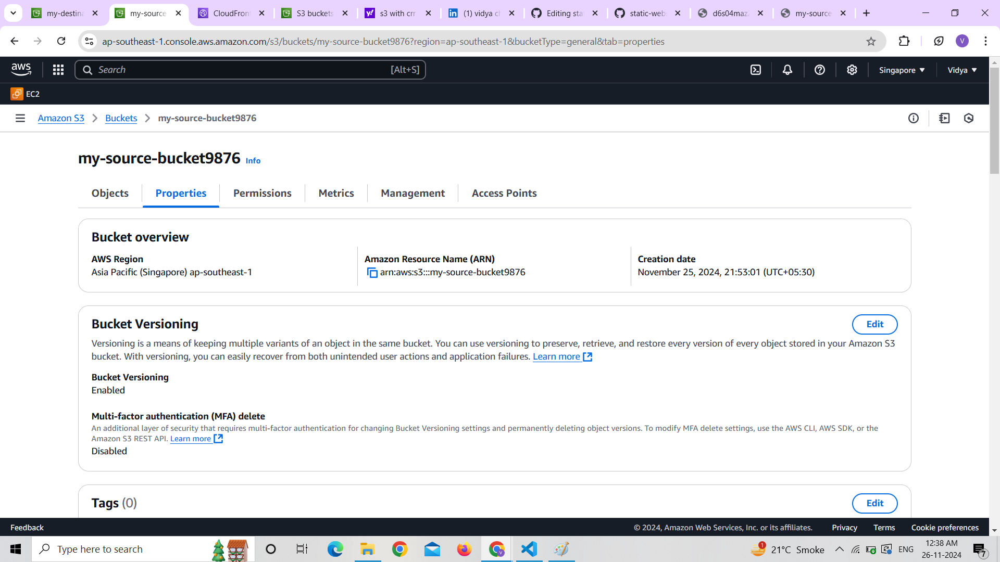
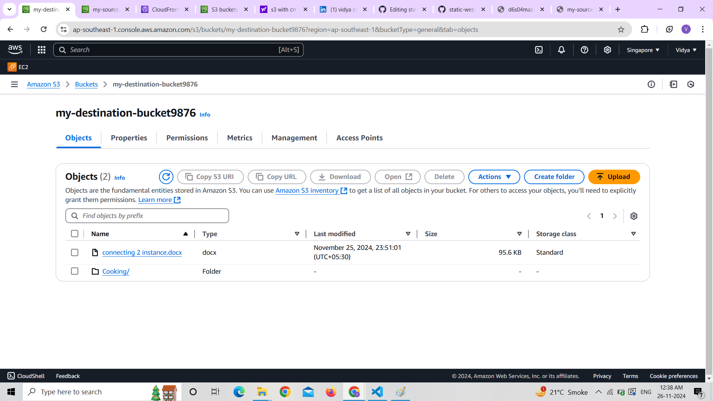
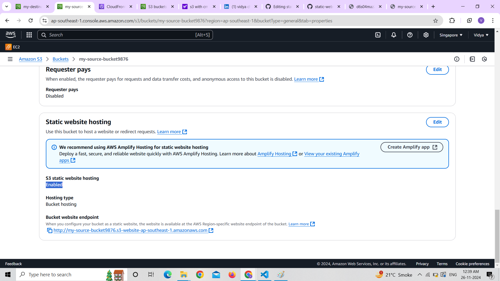
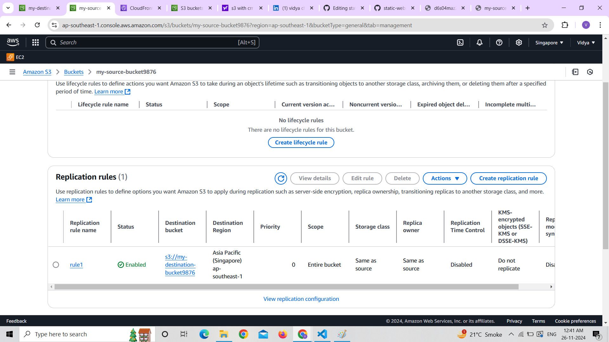
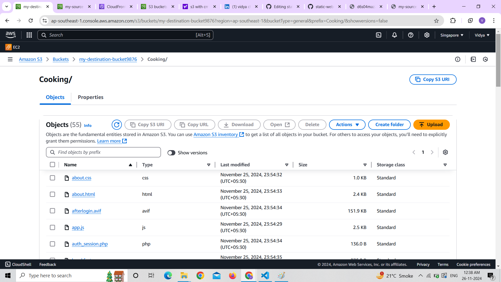
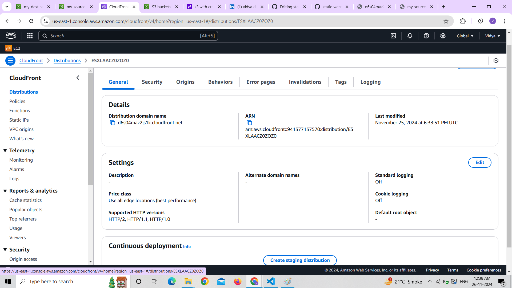
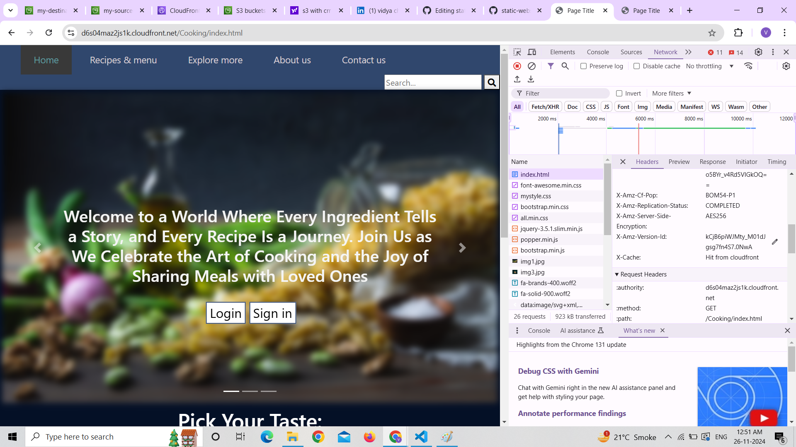

# AWS Mini-Project: Static Website Hosting with High Availability

## Overview

This project demonstrates hosting a static website using **Amazon S3** and enhancing its availability with **CloudFront**. Additionally, **Same-Region Replication (SRR)** was implemented to ensure data redundancy and high availability.

---

## Features

- **Static Website Hosting**: A fully functional website hosted on S3.
- **Global Content Delivery**: Integrated CloudFront for faster access and reduced latency.
- **High Availability**: Configured SRR to replicate data within the same region.
- **Secure Access**: Restricted direct S3 access using bucket policies, allowing only CloudFront.

---

## Implementation

### 1. Static Website Setup
- **Source Bucket**: Uploaded website files (`index.html`, `error.html`) to an S3 bucket.
- Enabled **static website hosting** and accessed the site directly from the S3 URL.

### 2. Same-Region Replication (SRR)
- Created a **destination bucket** in the same region.
- Configured a replication rule to automatically sync data from the source bucket to the destination bucket.

### 3. CloudFront Distribution
- Set up a CloudFront distribution with the S3 bucket as the origin.
- Restricted access to the bucket using a policy, allowing access only from CloudFront.
- Tested the website using the CloudFront distribution URL.

---

## Results

### **Screenshots**
Here are the screenshots showing the project's implementation:

1. **S3 Bucket Configuration**  
   
   
   

3. **SRR Configuration**  
   
   
   

5. **CloudFront Distribution**  
   

6. **Website Hosting**  
   Access the website using CloudFront:  
   
   
   
   

---

## Challenges and Learnings

- Encountered an "Access Denied" issue with CloudFront, resolved by updating bucket policies.
- Gained practical experience in setting up SRR and understanding CloudFront caching behavior.

---

## Conclusion

This project successfully demonstrates hosting a static website with high availability and performance using AWS S3, CloudFront, and replication. It highlights the importance of content delivery networks and redundancy in modern cloud architectures.

